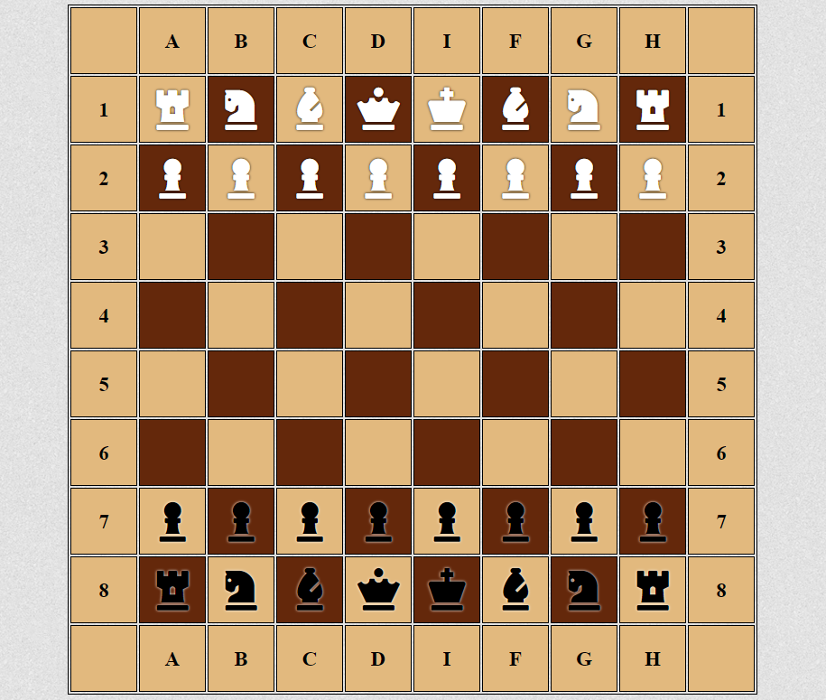

# JS course level 1

Это первое знакомство с языком javaScript. Курс содержит следующие темы:

* Урок 1. Основы языка JavaScript
* Урок 2. Основные операторы JavaScript
* Урок 3. Циклы, массивы, структуры данных
* Урок 4. Объекты в JavaScript
* Урок 5. Введение в DOM
* Урок 6. Обработка событий в JavaScript
* Урок 7. Урок-практикум
* Урок 8. Анонимные функции, замыкания

Итоговой работой курса является построение шахмотной доски средствами js (рисунок)

